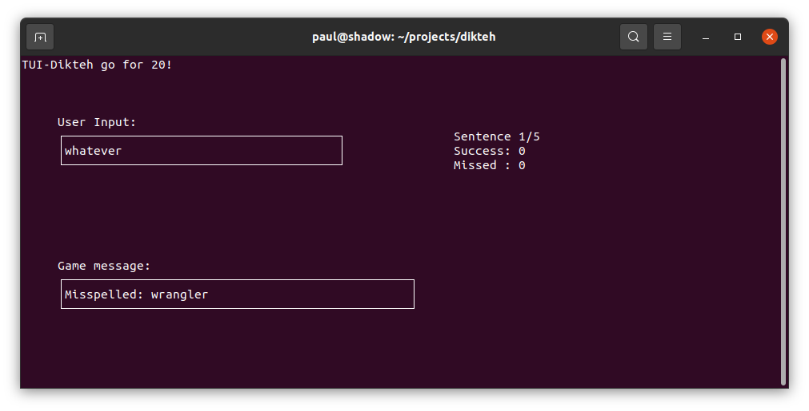

# dikteh  
A thought to continue to expand my and other's studies...  

## Introduction  
Learning a language can be difficult.  People can read books, follow study guides, write out word after word but still not quite master the use of a language.  Speaking is a huge part of communication but the strongest part involves listening.  Stopping, listening, and demonstrating an understanding of each word is so powerful.  

That is what this tool/programme does - it takes listening (dikteh) onto a whole new level by allowing for listening, writing down the heard word and then receiving immediate feedback from the original source text.  

The first language presented is English - a list of sentences, quote origin, and theme of the quote all stored in a spreadsheet.  Each round of sentences will be associated with a theme and subsequently, each word will be read out one at a time.  The user will have the option to repeat hearing the word, quitting, or better yet typing in the word itself.  

The programme will evaluate whether or not the word matches the spoken word.  A user who types in the appropriate response will receive notification of success!  An incorrect entry will result in the user being informed that their selection was incorrect and that the proper spelling of the word is presented.  

## Installation  
Initially, the plan was to run on Linux but the user base that was sampled is using Windows so the development focus and testing will be on a Windows environment that is running the text to speach language pack of English.  

### Windows:  

#### Python installation:  
If python is not installed on your system, follow these instructions to install python:  
&nbsp;&nbsp;&nbsp;[Installation of python3 on Windows](https://phoenixnap.com/kb/how-to-install-python-3-windows)  

#### DIKTEH Installation:  
1) (if git is installed - look below for installation instructions):  
&nbsp;&nbsp;&nbsp;C:\Users\Imawesome> git clone https://github.com/glebite/dikteh  

OR  

1) Navigate in your favourite browser to [https://github.com/glebite/dikteh](https://github.com/glebite/dikteh) and select Code->Download ZIP.  You will need to unzip the file to create the folder directory structure.  

2) cd dikteh:  
&nbsp;&nbsp;&nbsp;C:\Users\Imawesome> cd dikteh  

3) set up the requirements for the tool:  

**(virtual environment creation)**  
&nbsp;&nbsp;&nbsp;C:\Users\Imawesome\dikteh> python3 -m venv venv  
**(activate the virtual environment)**  
&nbsp;&nbsp;&nbsp;C:\Users\Imawesome\dikteh> venv\Scripts\activate.bat  
**(install the required modules from the requirements.txt file)**  
&nbsp;&nbsp;&nbsp;C:\Users\Imawesome\dikteh> python3 -m pip install -r requirements.txt

### Programme Execution:  
**(activate the virtual environment)**  
&nbsp;&nbsp;&nbsp;C:\Users\Imawesome\dikteh> venv\Scripts\activate.bat  

Execute the programme for 5 sentences using the sample sentences:  
&nbsp;&nbsp;&nbsp;C:\Users\Imawesome\dikteh> python3 src\cli_dikteh.py data\Sentences.xslx.xls 5  

### Feedback:  
Please use the Issues field on github to report a found issue.  Please include any and all error messages from the system.  This will aid in speedier fixes for your enjoyment.  
&nbsp;&nbsp;&nbsp;[Issues](https://github.com/glebite/dikteh/issues)  

### Git installation on Windows:  

[How to install git on windows.](https://phoenixnap.com/kb/how-to-install-git-windows)  

## TUI version:  
  

